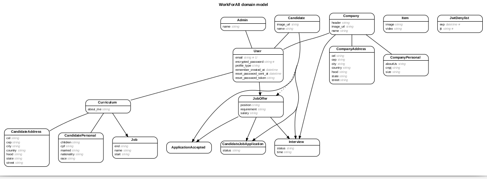

# Work For All - A full stack application to get your dream jobs

This is a full-fledge application that allows companies to post jobs, and users to apply for them. IT also shows the info of the company to users and users to companies, but with restrictions to provide security.

## How to use it

As a company, you can post job offers, and then after the user respond to it, you can accept the application. If you do, then the user needs to suggest a time to do a interview. Afterwards, you can either accept the time the user proposed, or propose a new one.

As an candidate, you can apply to a new job. If the company accepts you, you have the option to schedule a interview. If they accept your time good. If not, then they will suggest a new time, and you can either accept or suggest a new one, until is good for boot pars.

### Next Steps

- I will do action cable on rails, to allow realtime update as soon as it hits the database.
- A live chat with inbox message, in which the company and candidates can talk.

### Screenshots

#### Main Menu

- 
- 

### FEATURES

It has RubyOnRails on the backend and React on the front end. It features a lot of different models and associations, a RESTfull API, Redux for managing the store, and many restrictions so the information gets secure. It also features a full authentication system using JWT tokens, design with Tailwind, and Styled Components.

### Live Demo

- [Here](https://workforall.netlify.app/)
- [Backend](https://github.com/expjazz/final_capstone_backend)

### BUILT WITH

- React
- Redux
- RubyOnRails for the Backend
- Tailwind CSS
- Javascript
- JWT token

### Getting Started

- First, clone the Backend Repo;
- Run bundle install and rails db:migrate;
- Run rails s to start the development server.
- Clone the frontend Repo to your local machine;
- `cd` into the project directory;
- Run `yarn install` to install the necessary modules;
- To check in development mode, run `yarn start`, press `y ` and the page will automatically load on [localhost:3001](localhost:3001).

### AUTHORS

👤Expedito Andrade

- Github: [@githubexpjazz](https://github.com/expjazz)
- Twitter: [@expjazz](https://twitter.com/expeditoandrade13)
- Linkedin: [Expedito Andrade](https://www.linkedin.com/in/expedito-andrade/)
- Portfolio: [Expedito Andrade](https://expjazz.github.io/expedito_andrade/)

### Show your support

Give a star if you like this project!

### Acknowledgments

- Microverse
- This data is Fake. The idea is to showcase a possible dashoard

### 🤝 Contributing

Contributions, issues and feature requests are welcome! Start by:

- Forking the project
- Cloning the project to your local machine
- `cd` into the project directory
- Run `git checkout -b your-branch-name`
- Make your contributions
- Push your branch up to your forked repository
- Open a Pull Request with a detailed description to the development branch of the original project for a review

### Show your support

Give a ⭐️ if you like this project!

### 📝 License

This project is MIT licensed